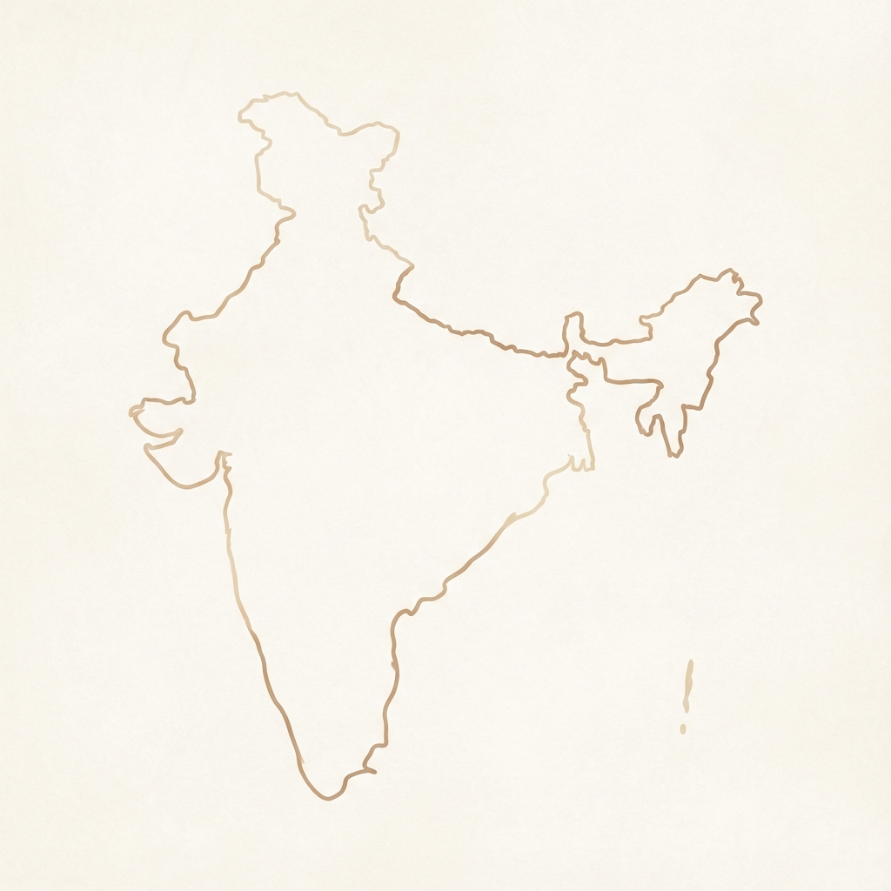

# CoffeeSoul | Your Mood-Based Caffeine Concierge ☕✨

CoffeeSoul is a modern, interactive web application designed to match users with their perfect Indian coffee bean and brewing method based on their current mood and "vibe."



## 🚀 Key Features

### 1. 🧠 Mood-Based Recommendation Engine
-   **Dual Scoring Algorithm**: Unlike simple quizzes, CoffeeSoul calculates scores independently for **Beans** (Origin/Flavor) and **Brew Methods** (Texture/Strength).
-   **Vibe Matching**: Users answer abstract questions (e.g., "What vibe are you chasing?", "Pick a sound") which map to semantic tags like 'monsoon', 'earthy', 'strong', or 'creative'.

### 2. 🗺️ Interactive "Vibe" Map of India
-   **Visual storytelling**: Features a custom-designed, warm-toned map of India that aligns with the app's premium aesthetic.
-   **Dynamic Pinning**: Automatically points to the specific region (e.g., *Malabar Coast*, *Araku Valley*) where the recommended bean is grown.
-   **Geographic Accuracy**: Use of precision coordinates to ensure pins land exactly on the correct districts.

### 3. 🍱 Rich Result Cards
-   **Comprehensive Info**: Displays the coffee's Region, Roast Level, Flavor Notes, and a "Did You Know?" fact.
-   **Brew Guide**: Provides a specific recipe (Grind size, Ratio, Time) for the recommended brew method.

---

## 🛠️ Technology Stack

### Frontend
-   **React.js**: Component-based UI architecture.
-   **Vite**: Fast build tool and development server.
-   **Vanilla CSS**: Custom-crafted, responsive styling with CSS variables for a consistent design system.

### Data & Logic
-   **Structured Data**: `coffeeData.js` acts as a local database containing relational data between Beans, Brews, and Quiz Questions.

---

## 🤖 AI & Computer Vision Calibration

One of the most technically advanced features of this project is the **Automated Map Calibration** workflow used to ensure the map pins are accurate.

### The Challenge
We updated the UI with a stylized, artistic map of India that had no geographical metadata. Placing pins manually was inaccurate and prone to error.

### The Solution: Python + OpenCV
We implemented a custom calibration pipeline `scripts/calibrate_with_reference.py` that uses Computer Vision to map real-world coordinates to the artistic image.

1.  **Reference Mapping**: We defined a **Geographic Bounding Box** for India (Lat: 8.1°N - 37.1°N, Lon: 68.1°E - 97.4°E).
2.  **Landmass Detection**: Used **OpenCV (`cv2`)** to programmatically detect the contours and bounding box of the landmass in the stylized PNG map.
3.  **Coordinate Transfer**:
    *   Input: Real-world Latitude/Longitude of coffee regions (e.g., Araku: 18.33°N, 82.87°E).
    *   Process: Calculated the relative proportional position of these coordinates within the geographic bounds.
    *   Output: Transformed these proportions into precise CSS percentages (`top`, `left`) relative to the visual map container.

This ensures that even on a stylized, "vibe-based" map, the geological locations are **scientifically accurate**.

---

## 📦 How to Run

1.  **Install Dependencies**
    ```bash
    npm install
    ```

2.  **Start Development Server**
    ```bash
    npm run dev
    ```

3.  **Open in Browser**
    Navigate to `http://localhost:5173/`

---

*Crafted with ☕ and Code.*
